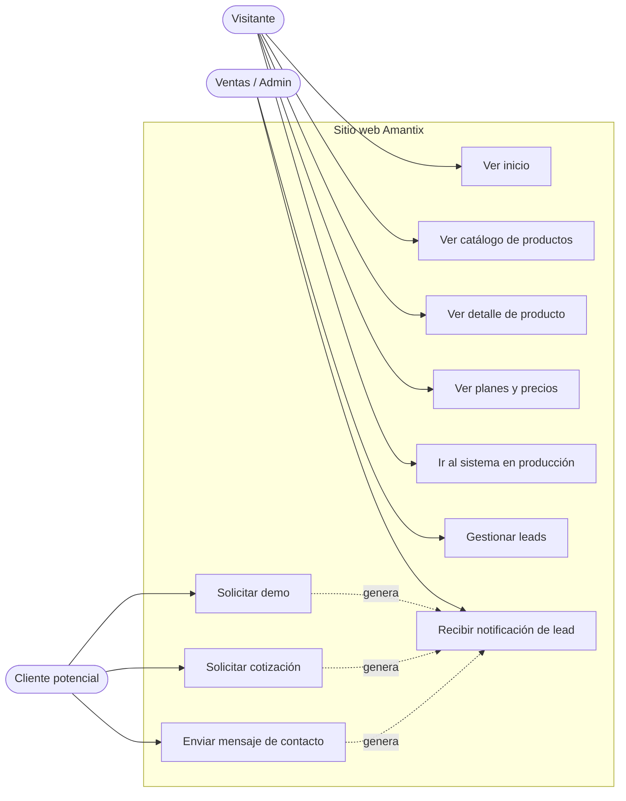
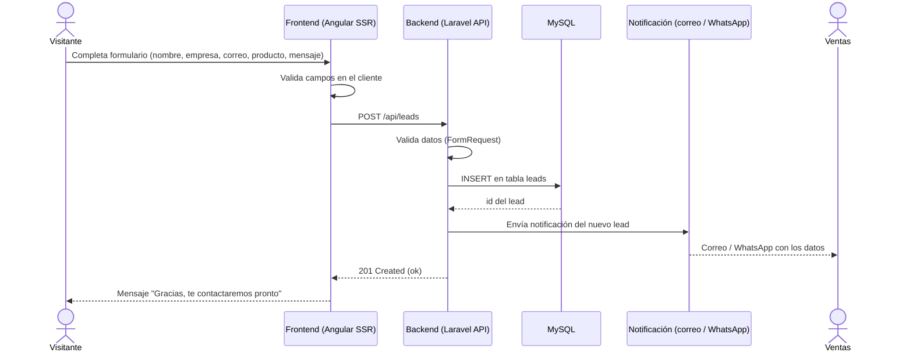
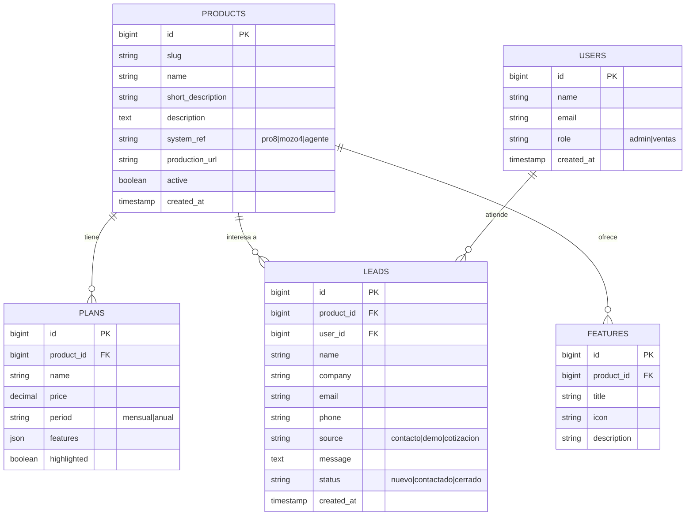
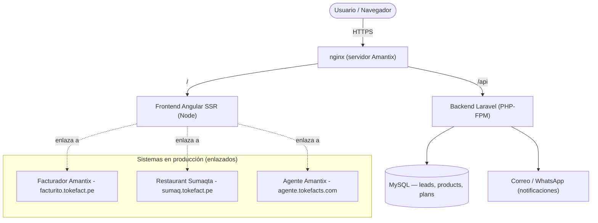
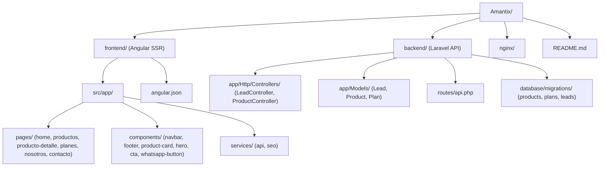
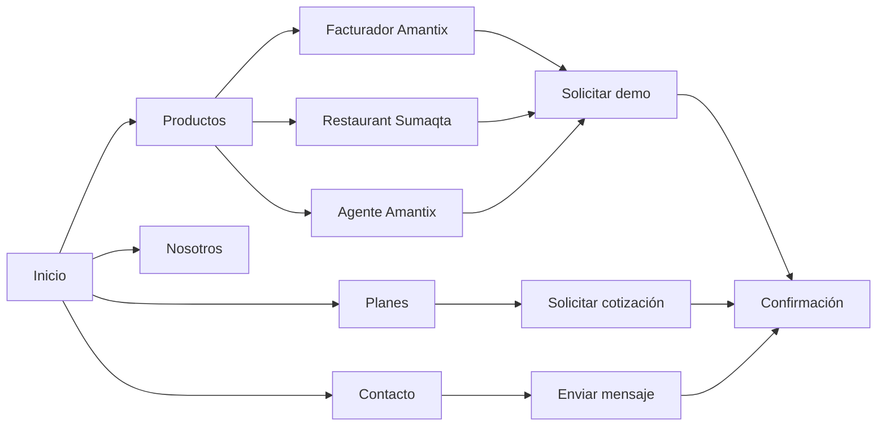

# Amantix — Sitio web corporativo

Sitio web institucional de **Amantix**, empresa de desarrollo de software que crea y comercializa sistemas de gestión empresarial. El sitio presenta la empresa, su catálogo de productos y capta clientes (leads) para la venta de los sistemas.

---

## 1. Objetivo del sitio

Una web de **marketing + captación** (no es uno de los sistemas en sí) que:

- Presenta a Amantix y su propuesta de valor.
- Muestra el **catálogo de productos** (3 sistemas) con sus funcionalidades, planes y casos de uso.
- Permite **solicitar una demo / cotización** y contactar a ventas.
- Sirve de punto de entrada (con enlaces) a cada sistema en producción.

---

## 2. Productos de Amantix (catálogo)

El sitio documenta y vende tres sistemas propios:

### 2.1. Facturador Amantix
> Sistema base: `pro8`

Sistema de **facturación electrónica** integral para Perú, conectado a **SUNAT**.

- Comprobantes electrónicos (factura, boleta, nota de crédito/débito), guías de remisión (GRE).
- Multi-tenant: cada empresa cliente opera con su propio RUC y base de datos aislada.
- **SIRE** — extracción del Registro de Compras/Ventas electrónico desde SUNAT.
- Inventario, almacenes, listas de precios, POS, reportes y panel del contador.
- Stack del sistema: Laravel + frontend SPA + MySQL (multi-tenant `hyn/tenancy`).
- En producción: `facturito.tokefact.pe`.

### 2.2. Restaurant Sumaqta
> Sistema base: `mozo4`

Sistema de **gestión para restaurantes** (punto de venta gastronómico).

- Toma de comandas desde el celular del mozo; impresión en cocina/caja.
- Gestión de mesas, salones, carta/menú, pedidos y cuentas.
- Impresión de comandas (la PC con la app imprime vía QZ Tray; el celular registra la orden).
- Integración con facturación electrónica para emitir el comprobante.
- En producción: `sumaq.tokefact.pe`.

### 2.3. Agente Amantix
> Sistema base: `agente`

Plataforma SaaS para operar **agentes multibancarios** en Perú.

- Multi-tenant por subdominio (`empresa.midominio.pe`), cada cliente con su BD aislada.
- Cajeros registran ingreso/salida de dinero contra múltiples billeteras (BBVA, BCP, Yape, Plin, Western Union, efectivo, etc.).
- Emisión de boletas SUNAT, préstamos y cierre de caja diario.
- Panel de administración central + panel por empresa.
- En producción: `agente.tokefacts.com` (+ `admin.agente.tokefacts.com`).

---

## 3. Tecnologías del sitio web

| Capa | Tecnología |
|---|---|
| **Frontend** | **Angular** (SSR para SEO) + TypeScript |
| **Backend / API** | **Laravel** (PHP) — API REST para formularios de contacto/leads |
| **Base de datos** | MySQL |
| **Estilos** | (a definir: Tailwind / SCSS) |
| **Servidor web** | nginx |
| **Despliegue** | servidor propio (VPS) + dominio Amantix |

> Misma base tecnológica que los productos (Angular + Laravel), para reutilizar conocimiento y componentes.

---

## 4. Estructura del sitio (secciones / páginas)

| Página | Contenido |
|---|---|
| **Inicio (Home)** | Hero con propuesta de valor, resumen de los 3 productos, CTA "Solicitar demo". |
| **Productos** | Listado de los 3 sistemas con tarjetas (icono, nombre, descripción corta). |
| **Producto — Facturador Amantix** | Detalle, funcionalidades, capturas, planes, CTA. |
| **Producto — Restaurant Sumaqta** | Detalle, funcionalidades, capturas, planes, CTA. |
| **Producto — Agente Amantix** | Detalle, funcionalidades, capturas, planes, CTA. |
| **Planes / Precios** | Comparativa de planes por producto. |
| **Nosotros** | Quiénes somos, misión, equipo. |
| **Contacto** | Formulario (nombre, empresa, correo, teléfono, producto de interés, mensaje) → guarda lead y notifica por correo/WhatsApp. |
| **Demo / Cotización** | Formulario de solicitud de demo o cotización. |

Elementos transversales: navbar con logo + menú, footer con contacto/redes, botón flotante de WhatsApp.

---

## 5. Estructura del proyecto (propuesta)

```
Amantix/
  frontend/            # Angular (SSR)
    src/app/
      pages/           # home, productos, producto-detalle, planes, nosotros, contacto
      components/       # navbar, footer, product-card, cta, hero, whatsapp-button
      services/        # api (contacto/leads), seo
    angular.json
  backend/             # Laravel (API)
    app/Http/Controllers/  # ContactController, LeadController
    routes/api.php          # POST /contact, POST /demo
    database/migrations/    # leads
  nginx/               # vhost del sitio
  README.md
```

(La estructura final se ajusta al implementar; esta es la guía inicial.)

---

## 6. Funcionalidades del sitio (alcance)

- **SEO**: Angular SSR, metadatos por página, sitemap, Open Graph (importante por ser sitio de venta).
- **Catálogo de productos** con páginas de detalle.
- **Captación de leads**: formularios de contacto y de demo → se guardan en BD (tabla `leads`) y se notifican por correo (y opcionalmente WhatsApp).
- **Responsive** (móvil/escritorio).
- **Multi-idioma** (opcional, a futuro): español por defecto.
- **Integración**: enlaces directos a cada sistema en producción.

---

## 7. Datos de leads (tabla `leads`)

```
id, name, company, email, phone, product_interest (facturador|restaurant|agente),
message, source (contacto|demo|cotizacion), created_at, updated_at
```

---

## 8. Productos y dominios de producción (referencia)

| Producto en el sitio | Sistema | Dominio en producción |
|---|---|---|
| Facturador Amantix | pro8 | `facturito.tokefact.pe` |
| Restaurant Sumaqta | mozo4 | `sumaq.tokefact.pe` |
| Agente Amantix | agente | `agente.tokefacts.com` |

---

## 9. Próximos pasos

1. Inicializar el proyecto Angular (SSR) en `frontend/` y la API Laravel en `backend/`.
2. Definir identidad visual (logo, paleta, tipografía) de Amantix.
3. Maquetar Home + páginas de producto.
4. Implementar formularios de contacto/demo → API `leads` + notificación.
5. Configurar SEO (SSR, metadatos, sitemap) y desplegar con nginx en el dominio Amantix.

---

## 10. Diagramas

Diagramas en Mermaid (se renderizan en GitHub y en cualquier visor compatible).

### 10.1. Casos de uso



### 10.2. Secuencia — Solicitar demo / contacto



### 10.3. Entidad-relación



### 10.4. Arquitectura de despliegue



### 10.5. Arquitectura de carpetas



### 10.6. Flujo de navegación



---

## 11. Guía de estilos (para generar las interfaces)

Sistema de diseño del sitio. Sirve de brief para producir las pantallas. La meta: **corporativo, sobrio y premium**, que transmita confianza en un software que maneja dinero e impuestos — **no** el look genérico de IA, **sin** colores chillones.

### 11.1. Concepto

**Tesis: "confianza diseñada".** Amantix construye sistemas que manejan facturación SUNAT, caja y operaciones bancarias. El diseño comunica **precisión, seguridad y solvencia**, no entretenimiento. El elemento firma es un **sello de cumplimiento** (estilo ISO/IEC 27001) y micro-etiquetas monoespaciadas tipo código de registro; las tarjetas de producto se ven como **credenciales**.

Evitar explícitamente los clichés de IA: fondo crema + serif de alto contraste + terracota; negro con acento verde ácido; layout de periódico con filetes. No usarlos.

### 11.2. Paleta — complementario apagado (regla 60/30/10)

Relación de color: **complementario desaturado** (navy frío ↔ latón cálido), equilibrado por un campo neutro gris-niebla y un teal de respaldo solo para señales de seguridad. Proporción: **60%** neutros (niebla/blanco), **30%** navy, **10%** latón; teal < 5%.

| Token | Hex | Uso |
|---|---|---|
| `--ink` | `#0F1D2E` | Navy profundo. Hero, footer, texto principal sobre claro. |
| `--steel` | `#2A3F54` | Navy-pizarra. Superficies sobre oscuro, bordes en secciones dark. |
| `--brass` | `#B0894F` | Latón apagado. Acento firma, CTAs, subrayados. **Con restricción.** |
| `--teal` | `#2F6E68` | Teal apagado. Señales de seguridad/ISO, hover de enlaces. |
| `--mist` | `#EEF1F3` | Gris-niebla frío. Fondo de página (NO crema). |
| `--cloud` | `#FFFFFF` | Tarjetas y superficies. |
| `--slate-600` | `#5A6B7B` | Texto secundario / apoyo. |
| `--line` | `#DCE2E6` | Filetes y divisores (1px). |

Reglas de color:
- **Latón solo en acentos** (títulos clave, CTA, sello). Nunca como fondo de bloques grandes ni en texto de cuerpo.
- **CTA**: fondo latón con texto `--ink` (texto oscuro sobre latón = buen contraste). El hover oscurece levemente.
- **Teal** reservado a confianza/seguridad (badges "Datos protegidos", certificaciones), no decorativo.
- Contraste mínimo **AA**: cuerpo `--ink` sobre `--mist`/`--cloud`; latón solo en texto grande o sobre `--ink`.

### 11.3. Tipografía

Pareja deliberada, ligada al rubro (software empresarial + cifras):

| Rol | Fuente | Uso |
|---|---|---|
| **Display** | **Archivo** (700–800) | Titulares. Sensación industrial-corporativa, confiada. |
| **Cuerpo** | **IBM Plex Sans** (400/500/600) | Texto, párrafos, UI. Herencia "enterprise/seguridad". |
| **Datos / etiquetas** | **IBM Plex Mono** (500) | Cifras (RUC, montos, N° de comprobante), micro-etiquetas, códigos de sección. |

Escala (desktop; usar `clamp()` para responsive):

| Nivel | Tamaño | Peso / detalle |
|---|---|---|
| Hero | `clamp(2.75rem, 6vw, 4.75rem)` | Archivo 800, tracking `-0.02em`, line-height 1.04 |
| H1 | 2.5rem | Archivo 700 |
| H2 | 2rem | Archivo 700 |
| H3 | 1.5rem | Archivo 600 |
| Cuerpo | 1.0625rem / 1.7 | Plex Sans 400 |
| Pequeño | 0.875rem | Plex Sans 400 |
| Micro-etiqueta | 0.75rem | Plex Mono 500, MAYÚSCULAS, tracking `0.12em` |

### 11.4. Layout, espaciado y forma

- **Grid base 4px.** Contenedor máx. 1200px. Columnas de 12.
- **Aire generoso:** padding de sección 96–128px en desktop, 56–72px en móvil.
- **Radio controlado:** 8px tarjetas, 6px inputs/botones, pill (999px) solo en badges. Ni 0 (periódico) ni excesivo.
- **Sombra discreta:** `0 1px 2px rgba(15,29,46,.06)` en tarjetas; elevación leve en hover.
- **Filetes 1px** `--line` para estructurar, sin abusar.

Estructura significativa (no decorativa): **eyebrows monoespaciados** que codifican algo real, p. ej. `01 · FACTURACIÓN`, `REG. ISO/IEC 27001`, `RUC · SUNAT`. Numerar solo cuando hay secuencia real (procesos), no por adorno.

### 11.5. Componentes

- **Navbar**: logo + navegación + CTA "Solicitar demo" (latón). Fondo `--cloud`, hairline inferior; al hacer scroll, fondo `--ink` translúcido.
- **Hero**: titular-tesis + subtítulo + dos CTAs (primaria latón, secundaria contorno) + **sello de cumplimiento** (firma). Fondo `--ink`, micro-etiqueta mono arriba.
- **Tarjeta de producto (credencial)**: encabezado mono con código (`01 · FACTURADOR`), nombre, descripción corta, 3 features, CTA. Borde `--line`, acento latón al hover.
- **Sección de confianza**: badges de seguridad (ISO 27001, SUNAT, SSL) en teal/neutro.
- **Planes**: 3 columnas; plan destacado con borde latón y micro-etiqueta "Recomendado".
- **Formularios** (contacto/demo): labels visibles (sin placeholder como etiqueta), foco visible, nota de privacidad (ver 11.7).
- **Footer**: `--ink`, navegación, contacto, sello + leyenda de registro.
- **Botón flotante de WhatsApp**: discreto, esquina inferior derecha.

### 11.6. Movimiento (con restricción)

- Reveal sutil al hacer scroll (fade + 8px de subida).
- El **sello** se dibuja una vez al cargar el hero.
- Hover: elevación leve y aparición del acento latón en tarjetas.
- **Respetar `prefers-reduced-motion`** (desactivar animaciones).

### 11.7. ISO/IEC 27001 — implicaciones de diseño

Traducción de la norma a reglas concretas de interfaz (la web es marketing, pero debe reflejar la cultura de seguridad de la empresa):

- **Minimización de datos**: los formularios piden solo lo necesario (nombre, empresa, correo, teléfono, producto, mensaje). Nada de campos de más.
- **Consentimiento y propósito**: junto al botón de envío, nota visible: *"Usaremos tus datos solo para responder tu solicitud."* + enlace a política de privacidad.
- **Señales de confianza visibles**: badges de **ISO/IEC 27001**, conexión segura (HTTPS) y SUNAT en la sección de confianza y el footer.
- **No exponer datos sensibles** en la UI ni en URLs; los envíos van por HTTPS a la API.
- **Mensajería de seguridad** clara en estados: confirmación tras enviar ("Recibimos tu solicitud"), errores que explican qué pasó y cómo resolver, sin tecnicismos.
- **Trazabilidad**: cada lead se registra con fecha/origen (refleja control, no se muestra al visitante).

### 11.8. Usabilidad y accesibilidad (piso de calidad)

- **Responsive** completo hasta móvil.
- **Foco de teclado visible** (anillo `--teal`), navegación por tab coherente.
- **Contraste AA** en todo texto; objetivos táctiles ≥ 44px.
- **Jerarquía clara**: un solo CTA primario por vista; lenguaje en voz activa ("Solicitar demo", no "Enviar").
- **Estados vacíos/errores** con dirección, no disculpas.

### 11.9. Boceto del hero (referencia)

```
┌───────────────────────────────────────────────────────────────┐
│  AMANTIX            Productos  Planes  Nosotros   [Solicitar demo]│
├───────────────────────────────────────────────────────────────┤
│  REG. ISO/IEC 27001 · SOFTWARE EMPRESARIAL          (mono, latón) │
│                                                                  │
│  Software que tu                                  ◜───────◝       │
│  negocio puede                                    │  SELLO  │     │
│  facturar, operar                                 │ 27001   │     │
│  y controlar.                                     ◟───────◞       │
│                                                                  │
│  Facturación SUNAT, restaurante y agente bancario, en una sola   │
│  casa de software.                                               │
│                                                                  │
│  [ Solicitar demo ]   [ Ver productos ]                          │
│                                                                  │
│  ── FACTURADOR ──  ── SUMAQTA ──  ── AGENTE ──   (mono, filetes)  │
└───────────────────────────────────────────────────────────────┘
```

### 11.10. Resumen para el generador

> Diseño **corporativo y premium** para una casa de software peruana que maneja dinero e impuestos. Paleta **complementaria apagada**: navy `#0F1D2E` + latón `#B0894F` sobre niebla `#EEF1F3`, teal `#2F6E68` solo para seguridad; **sin colores chillones**, regla 60/30/10. Tipografía **Archivo** (display) + **IBM Plex Sans** (cuerpo) + **IBM Plex Mono** (cifras/etiquetas). Firma: **sello de cumplimiento ISO 27001** + micro-etiquetas mono tipo código de registro; tarjetas de producto como **credenciales**. Cumplir **ISO 27001** en la UI (minimización de datos, consentimiento, señales de confianza) y un **piso de accesibilidad AA**. Evitar los clichés de IA (crema+serif+terracota, negro+verde ácido, periódico).

